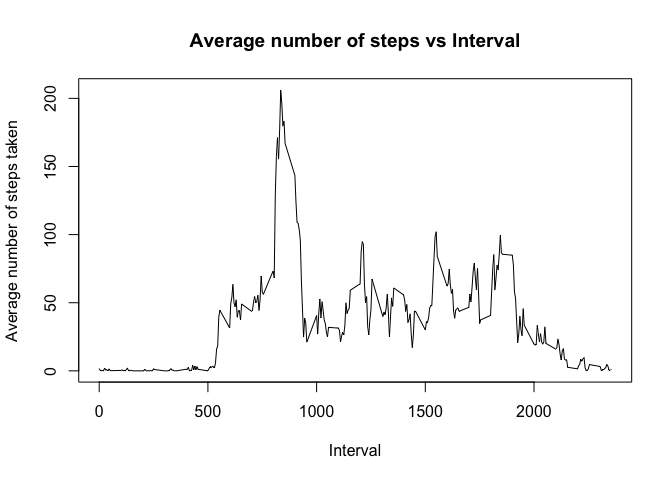

# Reproducible Research: Peer Assessment 1


## Loading and preprocessing the data

```r
activity <-read.csv("activity.csv")
stepsSumByDay <- tapply(activity$steps, activity$date, sum)
```

## What is mean total number of steps taken per day? 
#### Histogram

```r
hist(stepsSumByDay, main = "Total number of steps taken each day", xlab = "Total steps per day", ylab = "Frequency")
```

 
    
#### Report the mean and median of the total number of steps taken per day

#### Mean   

```r
mean(stepsSumByDay, na.rm = T)
```

```
## [1] 10766.19
```
#### Median  

```r
median(stepsSumByDay, na.rm = T)
```

```
## [1] 10765
```

## What is the average daily activity pattern?
#### Make a time series plot (i.e. type = "l") of the 5-minute interval (x-axis) and the average number of steps taken, averaged across all days (y-axis)   


```r
stepsMeanByInterval <- aggregate(steps ~ interval, data = activity, mean, na.rm = TRUE)
plot(stepsMeanByInterval, type = "l", main = "Average number of steps vs Interval", ylab = "Average number of steps taken", xlab = "Interval")
```

 

```r
## Imputing missing values
```

#### Which 5-minute interval, on average across all the days in the dataset, contains the maximum number of steps?

```r
stepsMeanByInterval[which.max(stepsMeanByInterval$steps), ]$interval
```

```
## [1] 835
```

## Imputing missing values
#### Calculate and report the total number of missing values in the dataset (i.e. the total number of rows with NAs)

```r
sum(as.numeric(is.na(activity$steps)))
```

```
## [1] 2304
```
#### Create a new dataset that is equal to the original dataset but with the missing data filled in.

```r
activityWithoutNA <- activity
for (i in 1:nrow(activityWithoutNA)) {
    if (is.na(activityWithoutNA[i, ]$steps)) {
        interval <- activityWithoutNA[i, ]$interval 
        step_replace <- stepsMeanByInterval[stepsMeanByInterval$interval == interval,]$steps
        activityWithoutNA[i, ]$steps <- step_replace
    }
}
```

#### Make a histogram of the total number of steps taken each day

```r
stepsSumByDayNoNA <- tapply(activityWithoutNA$steps, activityWithoutNA$date, sum)
hist(stepsSumByDayNoNA, main = "Total number of steps taken each day", xlab = "Total steps per day", ylab = "Frequency")
```

 

#### Calculate and report the mean and median total number of steps taken per day. 

#### Mean   

```r
mean(stepsSumByDayNoNA)
```

```
## [1] 10766.19
```
#### Median  

```r
median(stepsSumByDayNoNA)
```

```
## [1] 10766.19
```

#### Do these values differ from the estimates from the first part of the assignment? What is the impact of imputing missing data on the estimates of the total daily number of steps?

##### The mean not changed but median slightly lower.

## Are there differences in activity patterns between weekdays and weekends?

#### Create a new factor variable in the dataset with two levels -- "weekday" and "weekend" indicating whether a given date is a weekday or weekend day.


```r
activityWithoutNA$date <- as.Date(activityWithoutNA$date, "%Y-%m-%d") 
activityWithoutNA$day <- c("weekday")
for (i in 1:nrow(activityWithoutNA)){
    dayType <- weekdays(activityWithoutNA$date[i])    
  if (dayType == "Saturday" || dayType == "Sunday"){
    activityWithoutNA$day[i] <- "weekend"
  }
}
activityWithoutNA$day <- as.factor(activityWithoutNA$day)
stepsMeanByIntervalNoNA <- aggregate(steps ~ interval + day, activityWithoutNA, mean)
library(lattice)
xyplot(steps ~ interval | factor(day), data = stepsMeanByIntervalNoNA, aspect = 1/2, type = "l")
```

 
